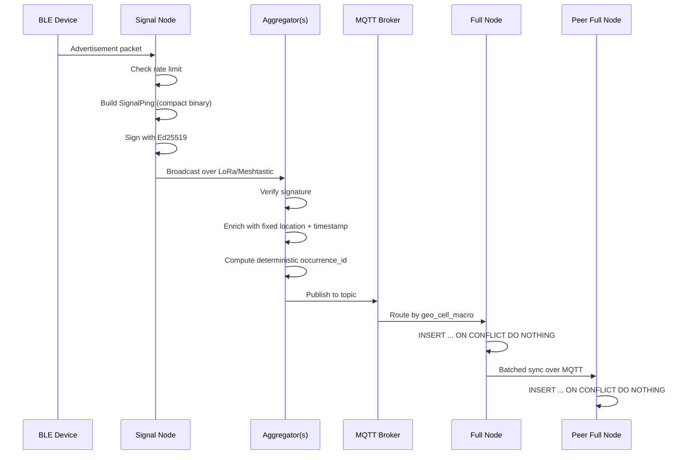

# Data Flow, Networking & Sync

## End-to-End Path



### Step-by-Step

1. **BLE device** emits advertisement packet
2. **Signal node** captures:
   - Checks local rate limit
   - Builds compact binary `SignalPing`
   - Signs with Ed25519
   - Broadcasts over LoRa/Meshtastic
3. **Aggregator node(s)** hear ping:
   - Verify signature
   - Enrich with known fixed location + corrected timestamp
   - Compute deterministic `occurrence_id`
   - Publish full `occurrences` record to MQTT
4. **MQTT broker** routes occurrence by topic to responsible full node(s)
5. **Full node** writes occurrence:
   - `INSERT ... ON CONFLICT DO NOTHING` handles duplicate delivery from multiple aggregators or MQTT QoS retries (free dedup)
6. **Full nodes sync with peers** on ongoing basis via application-level batched sync

---

## Transport Choices

### MQTT (Full/Aggregator ↔ Full Nodes)

**Topic scheme:** Hierarchical by geography
```
occurrences/{geo_cell_macro}/{node_id}
```

**QoS Level:** QoS 1 (at-least-once)
- Not QoS 2 — deterministic-ID + `ON CONFLICT DO NOTHING` pattern already absorbs duplicate delivery
- QoS 2 overhead not needed

**Subscription pattern:**
- Full node only subscribes to topics for geo cells it owns
- `occurrences/8a2a100000000000/#` (res-6 H3 cell prefix)

### LoRa/Meshtastic (Signal ↔ Aggregator)

**Payload budget:** ~200-256 bytes total

**Format:** Compact binary/protobuf (NOT JSON) — see `SignalPing` struct in [`data-model.md`](data-model.md)

**Key constraints:**
- Limited bandwidth
- No TLS (LoRa has no TLS)
- Signal nodes rely on Ed25519 signatures for provenance, not transport security

---

## Full-Node-to-Full-Node Sync

### Design Principles

- **Eventual consistency** is acceptable for this workload (append-mostly sensor data)
- Chose **application-level batched sync over MQTT** rather than Postgres native logical replication
  - Logical replication assumes relatively stable publisher/subscriber connections
  - This network has mix of always-on and intermittent nodes
  - Store-and-forward is default assumption

### Conflict Resolution

**Sync is conflict-free by construction:**
- Each occurrence row written once, by node/aggregator that captured it
- Never updated afterward
- No multi-writer update case to resolve — only inserts
- Deduplicated by ID via `ON CONFLICT DO NOTHING`

### Progress Tracking

**`sync_cursors` table** (see data-model) tracks:
- Per-peer replication progress in each direction
- Allows reconnecting node to know where to resume

### Sync Flow

```
Node A (interrupted)                Node B (always-on)
      |                                    |
      |--- Buffer locally while offline ---|
      |                                    |
      |<--- Heartbeat / reconnect ---------|
      |                                    |
      |-- Request: "last synced at X" ---->|
      |<-- Send batch: occurrences > X ----|
      |-- INSERT ... ON CONFLICT DO NOTHING|
      |<-- Ack / progress update ----------|
      |                                    |
      |-- Send batch: my new occurrences -->|
      |<-- INSERT ... ON CONFLICT DO NOTHING|
      |-- Ack / progress update ---------->|
```

---

## Node Connectivity Tiers

### Always-On Nodes
- Full nodes with stable power/network
- Participate in gossip
- Continuous sync with peers

### Intermittent Nodes
- Field/cellular full nodes
- May lose connectivity for hours/days
- **Keep capturing and buffering locally** regardless of upstream connectivity
- Sync opportunistically when reachable

### Stationary Signal Nodes
- Pre-registered with CA
- Fixed location (known to aggregators)
- Broadcast over LoRa (always-on radio, low power)
- Don't participate in gossip

---

## MQTT Topic Design

### Occurrence Ingestion
```
occurrences/{geo_cell_macro}/{reporting_node_id}
```

Example:
```
occurrences/8a2a100000000000/aggregator-042
```

### Peer-to-Peer Sync
```
sync/{target_node_id}
sync/{source_node_id}/updates
```

### Gossip Membership
```
gossip/{geo_cell_macro}/membership
```

### Open Questions
- [ ] Formalize MQTT topic scheme once macro/micro H3 resolutions are finalized

---

## Bandwidth Considerations

### Upload Budgeting

**Raw occurrences:**
- Full payload including `raw_payload_hex`
- May be large for high-volume deployments
- **Open question:** Bandwidth budgeting for raw vs. batched/compressed upload on constrained links

### Compression Options
- **Per-occurrence:** Minimal gain (already compact)
- **Batch compression:** Better ratio for many records
- **Delta sync:** Only send new records since last cursor

**Recommendation:** Implement batch compression with delta sync as default, raw upload as optional for debugging.

---

## Clock Discipline

### Full Nodes
- **Clock sync required** — each full node maintains NTP synchronization
- `observed_at` is sync-corrected UTC timestamp
- `observed_at_node_local` preserved for drift auditing

### Signal Nodes
- **No precise clock** — keeps hardware cost down
- `timestamp_offset` is seconds since signal node's last mesh sync beacon
- Aggregator corrects to UTC based on aggregator's clock sync

### Aggregators
- **Clock sync required** — must correct signal-node timestamps to UTC
- `observed_at` = aggregator's clock-sync-corrected time
- `observed_at_node_local` = signal node's offset + aggregator's beacon timestamp

### Clock Drift Auditing
- Keeping both `observed_at` and `observed_at_node_local` allows detection of clock drift over time
- Can correlate drift with node hardware, location, etc.
- May inform future sync cadence adjustments

---

## Failure Modes & Recovery

### Aggregator Failure
- Signal node continues broadcasting (no state to lose)
- Another aggregator in range will hear ping
- Multiple aggregators hearing same ping handled by dedup logic

### Full Node Offline
- Continues capturing locally
- Buffers occurrences in database (local partitions)
- On reconnect, syncs backlog via batched sync
- `sync_cursors` tracks where peer left off

### Network Partition
- Nodes continue operating independently
- Occurrences written locally with divergent `occurrence_id` (if full-node-originated)
- On reconnection, both sides sync
- `ON CONFLICT DO NOTHING` handles convergence
- No data loss expected (both sides keep their own, merge peer's)

### MQTT Broker Failure
- Aggregators buffer occurrences locally
- Full nodes buffer for peer sync
- On broker recovery, replay buffered occurrences
- Deterministic `occurrence_id` ensures no duplicates

---

## Open Questions / TODOs

- [ ] Bandwidth budgeting for raw vs. batched/compressed upload on constrained links
- [ ] Formalize MQTT topic scheme once macro/micro H3 resolutions are finalized
- [ ] Decide retry/backoff policy for sync_cursor catch-up after extended node downtime

---

## References

- **Architecture:** [`overview.md`](overview.md)
- **Data Model:** [`data-model.md`](data-model.md)
- **Storage:** [`storage.md`](storage.md)
- **Research Topics:** [`../open-questions/research-topics.md`](../open-questions/research-topics.md)
